# **CarND-P2 - Advanced Lane Finding**
[](http://www.udacity.com/drive)

## **Overview**
One of the most important characteristics for autonomous cars is the efficient detection of lane lines on highways. Computer vision methods are used with high frequency. This project shows a line detection using computer vision algorithms robustly. (Computer Vision Fundamentals, Camera Calibration, Gradients and Color Spaces, and advanced computer vision from Udacity's Self driving car Nanodegree program).


The goals / steps of this project are the following:

* Compute the camera calibration matrix and distortion coefficients given a set of chessboard images.
* Apply a distortion correction to raw images.
* Use color transforms, gradients, etc., to create a thresholded binary image.
* Apply a perspective transform to rectify binary image ("birds-eye view").
* Detect lane pixels and fit to find the lane boundary.
* Determine the curvature of the lane and vehicle position with respect to center.
* Warp the detected lane boundaries back onto the original image.
* Output visual display of the lane boundaries and numerical estimation of lane curvature and vehicle position.
---

## **Pipeline description**
### **1. Camera Calibration**
Camera calibration is the process of estimating intrinsic and/or extrinsic parameters. Intrinsic parameters deal with the camera's internal characteristics, such as, its focal length, skew, distortion, and image center. Extrinsic parameters describe its position and orientation in the world. Knowing intrinsic parameters is an essential first step for 3D computer vision, as it allows you to estimate the scene's structure in Euclidean space and removes lens distortion, which degrades accuracy. 

### Distortion

Image distortion occurs when a camera looks at 3D objects in the real world and transforms them into a 2D image; this transformation isn’t perfect. Distortion actually changes what the shape and size of these 3D objects appear to be. So, the first step in analyzing camera images, is to undo this distortion so that you can get correct and useful information out of them.

- Distortion can change the apparent size of an object in an image.
- Distortion can change the apparent shape of an object in an image.
- Distortion can cause an object's appearance to change depending on where it is in the field of view.
- Distortion can make objects appear closer or farther away than they actually are.

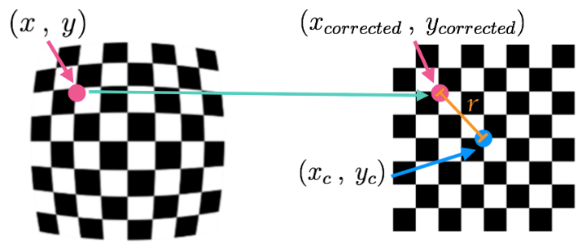

Find below the pipeline described to camera calibration process.

Converting an image, imported by cv2 or the glob API, to grayscale:
```
gray = cv2.cvtColor(img,cv2.COLOR_BGR2GRAY)
```
**Note**: If you are reading in an image using `mpimg.imread()` this will read in an RGB image and you should convert to grayscale using `cv2.COLOR_RGB2GRAY`, but if you are using `cv2.imread()` or the glob API, this will read in a BGR image and you should convert to grayscale using `cv2.COLOR_BGR2GRAY`.

Finding chessboard corners (for an 8x6 board):
```
ret, corners = cv2.findChessboardCorners(gray, (8,6), None)
```
Drawing detected corners on an image:

```
img = cv2.drawChessboardCorners(img, (8,6), corners, ret)
```
Camera calibration, given object points, image points, and the shape of the grayscale image:
```
ret, mtx, dist, rvecs, tvecs = cv2.calibrateCamera(objpoints, imgpoints, gray.shape[::-1], None, None)
```
Undistorting a test image:
```
dst = cv2.undistort(img, mtx, dist, None, mtx)
```
The shape of the image, which is passed into the calibrateCamera function, is just the height and width of the image. One way to retrieve these values is by retrieving them from the grayscale image shape array gray.shape[::-1]. This returns the image width and height in pixel values like (1280, 960).

It's important to use an entire grayscale image shape or the first two values of a color image shape. This is because the entire shape of a color image will include a third value -- the number of color channels -- in addition to the height and width of the image. For example the shape array of a color image might be (960, 1280, 3), which are the pixel height and width of an image (960, 1280) and a third value (3) that represents the three color channels in the color image which you'll learn more about later, and if you try to pass these three values into the calibrateCamera function, you'll get an error.

Two functions are important to camera calibration. The first one is `camera_calibration()`. This function is in charge calibrate the camera according to chessboard images, returns the mtx matrix,dist and images list with points drawn. It is supossed that the image is in the plane (x,y), thus z=0.

On the other hand, I used `check_calibration_process()` function to verify and count how many images were used to calibrate the camera. Because, some images does not have the minimum amount of black squares to calibrate the camera. So, this function verify and report how many images were useful.

Find below an example of an image to show both images. Left image is a distored pattern and the right one is the undistored image (after camera calibration process).
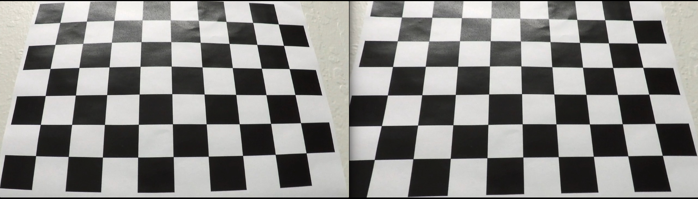
*Figure 1 - Distored and undistored image.*

### **2. Thresholded binary image**

To find a binary image, the Sobel operator was used for the images using the function `abs_sobel_thresh ()`. The function converts the RGB image into grayscale using the `cv2.cvtColor ()` function. Then, the derivative is obtained in 'x' and 'y' respectively to take the absolute value of the derivative in 'x' and 'y' by applying the function `cv2.Sobel ()`.
Then colored masks were applied to determine the point where the white and yellow lines could be seen using `binary_output [scaled_sobel> = thresh_min) & (scaled_sobel <= thresh_max)] = 1`.

We need to pass a single color channel to the `cv2.Sobel()` function, so first convert it to grayscale:
```
gray = cv2.cvtColor(im, cv2.COLOR_RGB2GRAY)
```
Note: Make sure you use the correct grayscale conversion depending on how you've read in your images. Use cv2.COLOR_RGB2GRAY if you've read in an image using mpimg.imread(). Use cv2.COLOR_BGR2GRAY if you've read in an image using cv2.imread().

Calculate the derivative in the xx direction (the 1, 0 at the end denotes xx direction):
```
sobelx = cv2.Sobel(gray, cv2.CV_64F, 1, 0)
```
Calculate the derivative in the yy direction (the 0, 1 at the end denotes yy direction):
```
sobely = cv2.Sobel(gray, cv2.CV_64F, 0, 1)
```
Calculate the absolute value of the xx derivative:
```
abs_sobelx = np.absolute(sobelx)
```
Convert the absolute value image to 8-bit:
```
scaled_sobel = np.uint8(255*abs_sobelx/np.max(abs_sobelx))
```
**Note:** It's not entirely necessary to convert to 8-bit (range from 0 to 255) but in practice, it can be useful in the event that you've written a function to apply a particular threshold, and you want it to work the same on input images of different scales, like jpg vs. png. You could just as well choose a different standard range of values, like 0 to 1 etc.

Create a binary threshold to select pixels based on gradient strength:
```
thresh_min = 20
thresh_max = 100
sxbinary = np.zeros_like(scaled_sobel)
sxbinary[(scaled_sobel >= thresh_min) & (scaled_sobel <= thresh_max)] = 1
plt.imshow(sxbinary, cmap='gray')
```
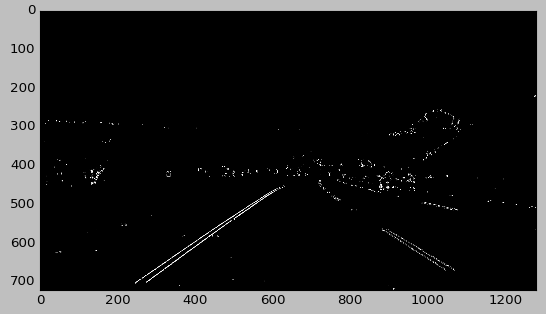
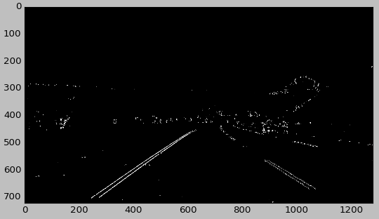
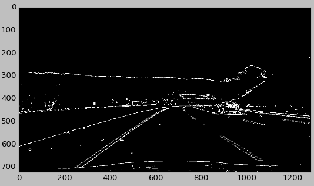
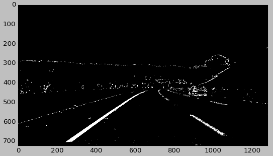


To have a more robust line detection, the magnitude of the gradient of the image is calculated using the `mag_thresh ()` function following the following pipeline. First you must obtain an image in a single channel, in this case, grayscale. Then, the gradients in 'X' and 'Y' are calculated separately using `sobelx = cv2.Sobel (gray, cv2.CV_64F, 1, 0, ksize = sobel_kernel)` and `sobely = cv2.Sobel (gray, cv2 .CV_64F, 0, 1, ksize = sobel_kernel) ` respectively.

Find below some images that I obtained.

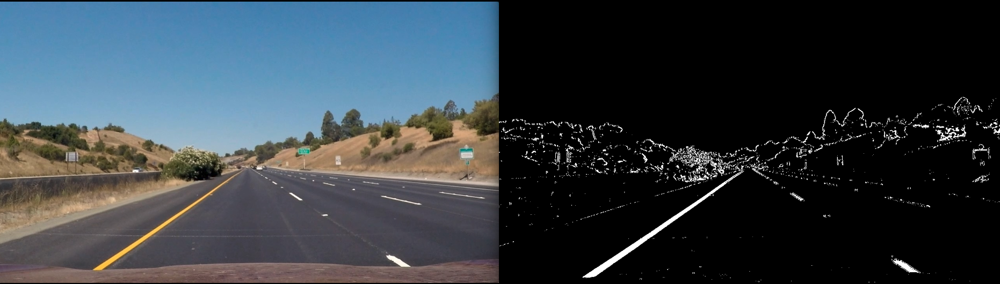
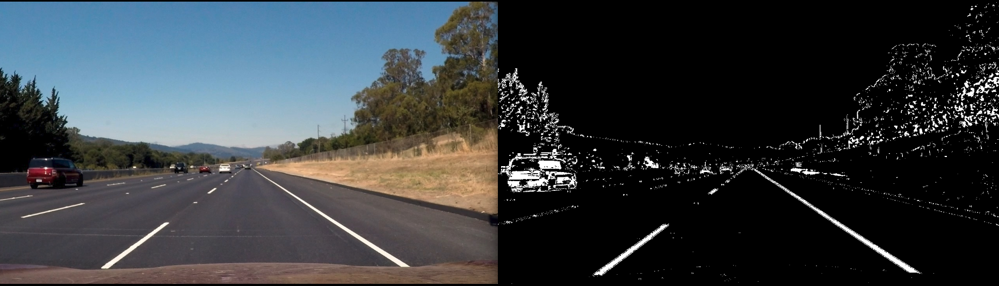
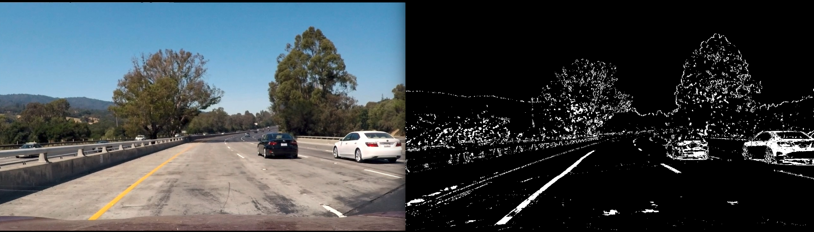
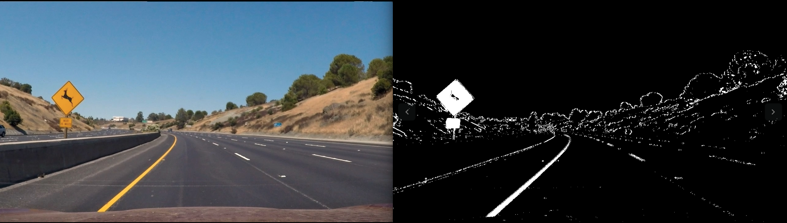
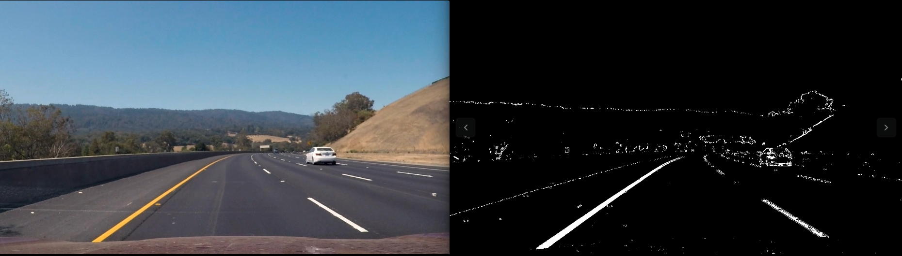
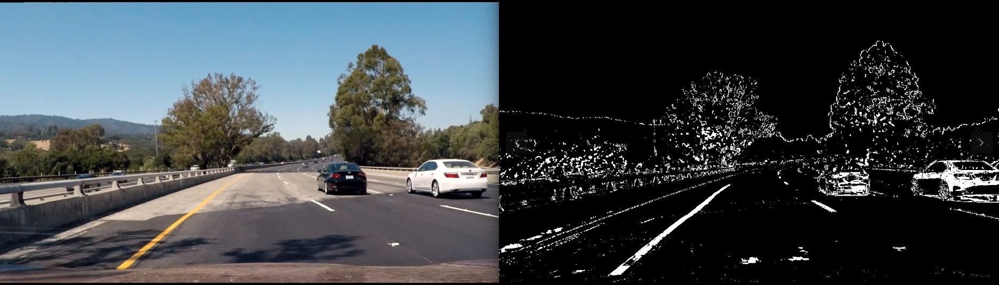
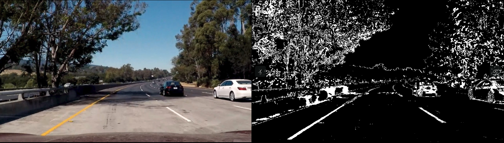
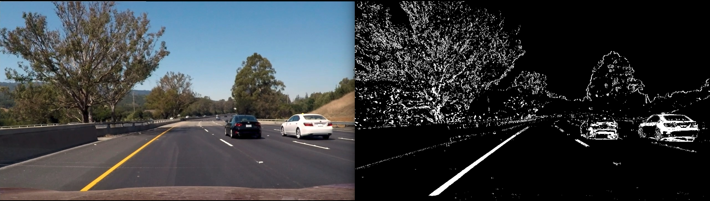

### **3. Perspective transform**

A perspective transform maps the points in a given image to different, desired, image points with a new perspective. The perspective transform you’ll be most interested in is a bird’s-eye view transform that let’s us view a lane from above; this will be useful for calculating the lane curvature later on. Aside from creating a bird’s eye view representation of an image, a perspective transform can also be used for all kinds of different view points.

### Examples of Useful Code

Compute the perspective transform, M, given source and destination points:
```
M = cv2.getPerspectiveTransform(src, dst)
```

Compute the inverse perspective transform:
```
Minv = cv2.getPerspectiveTransform(dst, src)
```

Warp an image using the perspective transform, M:
```
warped = cv2.warpPerspective(img, M, img_size, flags=cv2.INTER_LINEAR)
```
Note: When you apply a perspective transform, choosing four source points manually, as we did in this video, is often not the best option. There are many other ways to select source points. For example, many perspective transform algorithms will programmatically detect four source points in an image based on edge or corner detection and analyzing attributes like color and surrounding pixels.

- Undistort the image using cv2.undistort() with mtx and dist
- Convert to grayscale
- Find the chessboard corners
- Draw corners
- Define 4 source points (the outer 4 corners detected in the chessboard pattern)
- Define 4 destination points (must be listed in the same order as src points!)
- Use cv2.getPerspectiveTransform() to get M, the transform matrix
- use cv2.warpPerspective() to apply M and warp your image to a top-down view
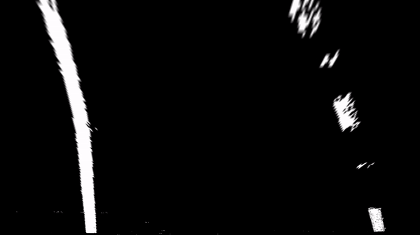

### **3. Polynomial Fitting and Line Curvature.**

### Lane Curvature

Self-driving cars need to be told the correct steering angle to turn, left or right. You can calculate this angle if you know a few things about the speed and dynamics of the car and how much the lane is curving.

One way to calculate the curvature of a lane line, is to fit a 2nd degree polynomial to that line, and from this you can easily extract useful information.

For a lane line that is close to vertical, you can fit a line using this formula: f(y) = Ay^2 + By + C, where A, B, and C are coefficients.

A gives you the curvature of the lane line, B gives you the heading or direction that the line is pointing, and C gives you the position of the line based on how far away it is from the very left of an image (y = 0).

After applying calibration, thresholding, and a perspective transform to a road image, you should have a binary image where the lane lines stand out clearly. However, you still need to decide explicitly which pixels are part of the lines and which belong to the left line and which belong to the right line.

Plotting a histogram of where the binary activations occur across the image is one potential solution for this.

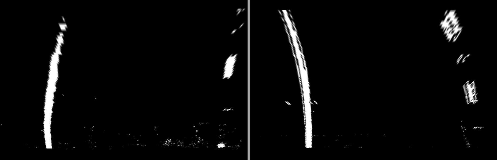
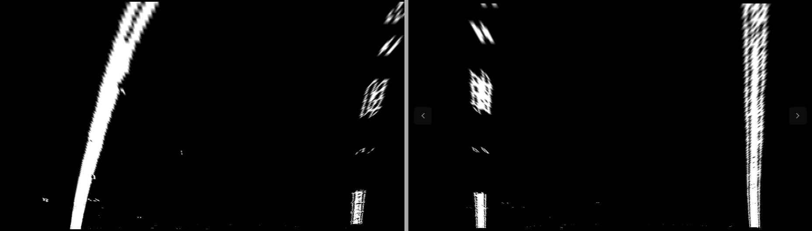
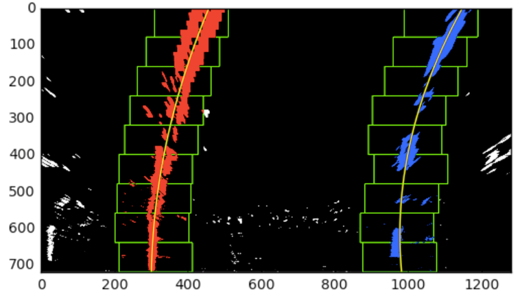
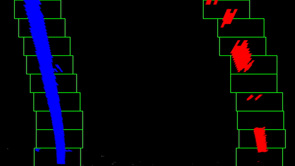


As shown in the previous animation, we can use the two highest peaks from our histogram as a starting point for determining where the lane lines are, and then use sliding windows moving upward in the image (further along the road) to determine where the lane lines go.

```
def fit_polynomial(binary_warped):
    # Find our lane pixels first
    leftx, lefty, rightx, righty, out_img = find_lane_pixels(binary_warped)

    # Fit a second order polynomial to each using `np.polyfit`
    left_fit = np.polyfit(lefty, leftx, 2)
    right_fit = np.polyfit(righty, rightx, 2)

    # Generate x and y values for plotting
    ploty = np.linspace(0, binary_warped.shape[0]-1, binary_warped.shape[0] )
    try:
        left_fitx = left_fit[0]*ploty**2 + left_fit[1]*ploty + left_fit[2]
        right_fitx = right_fit[0]*ploty**2 + right_fit[1]*ploty + right_fit[2]
    except TypeError:
        # Avoids an error if `left` and `right_fit` are still none or incorrect
        print('The function failed to fit a line!')
        left_fitx = 1*ploty**2 + 1*ploty
        right_fitx = 1*ploty**2 + 1*ploty

    ## Visualization ##
    # Colors in the left and right lane regions
    out_img[lefty, leftx] = [255, 0, 0]
    out_img[righty, rightx] = [0, 0, 255]

    # Plots the left and right polynomials on the lane lines
    #plt.plot(left_fitx, ploty, color='yellow')
    #plt.plot(right_fitx, ploty, color='yellow')

    return out_img, left_fit, right_fit, ploty
```
### **5. Results.**

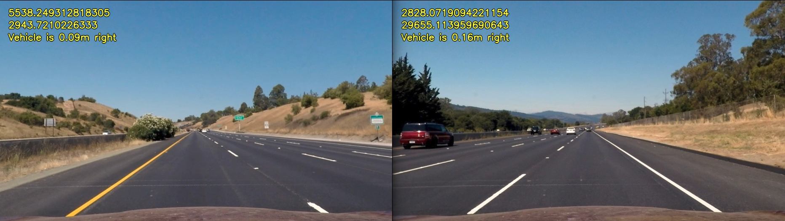
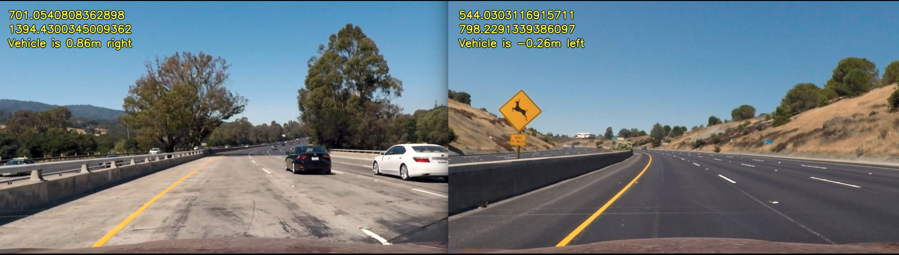
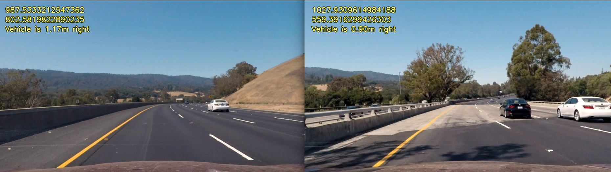
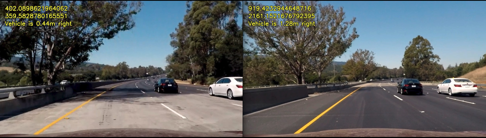

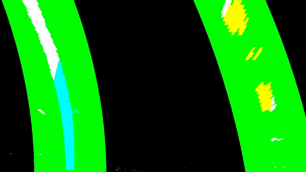
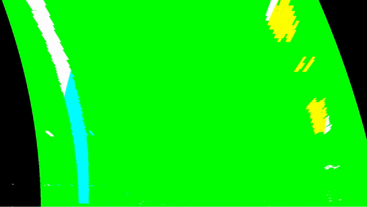

### **6. Discussion.**

The pattern size and quality is of extreme importance. Let’s consider the case of a chessboard pattern. The calibration process requires to detect the inner corner of the chessboard and the assumption of the algorithm is that every chessboard square is a perfect square. Another assumption is, hence, that the pattern is perfectly planar.
Too much parameters to tune. Move up or move down a parameter could affect or improve the process for specific environmental conditions in images or videos. Static parameters are not the final solution for this problem, others methods can be explored to find the correct parameters in each frame extracting more information of car's environment using AI algorithms.

---
## **Authors**
* **Juan Francisco Jurado Paez**
* Phone: +1 513 909 4704 / +57 313 247 4186.
* Mail: juanjuradop@gmail.com - jj@kiwicampus.com 
* LinkedIn: https://www.linkedin.com/in/juanfjuradop/
